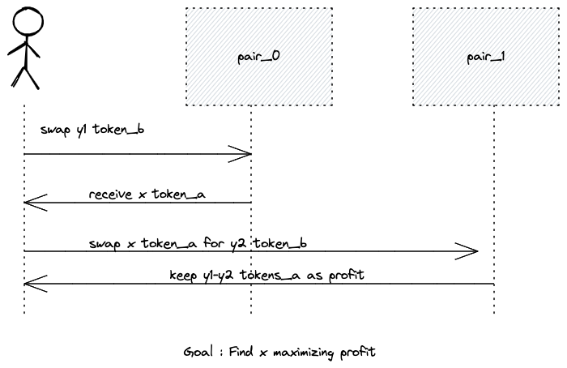

# An AMM arbitrage bot on Starknet

As more and more AMM are building on Starknet, the arbitrage opportunities between these protocols is going to rise sharply.
This repo is a proof of concept of how to do this.

Note : This repo is purely a PoC and is not intended to be used elsewhere. The calculations are totally unsafe, not compatible with ERC20 and not tested on any live AMM. It is only provided for learning purposes and needs to be improved a lot to be efficient.
Besides that, it's still WIP.
## Maths

The most important part of this bot is the underlying math to detecte opportunities.
We're going to focus on constant-product AMMs such that $a*b=k$ where $a$ and $b$ are the reserves of the two currencies and $k$ is a constant.
Consider 2 pairs $Pair_0$ and $Pair_1$ such that :
|   |                    | $Pair_0$ | $Pair_1$ |
|---|--------------------|--------|--------|
|   | Base Token amount  | a1     | a2     |
|   | Quote Token amount | b1     | b2     |

When you swap a token a for a token b, the reserves evolve respecting the constant product formula:

$(a + \Delta a) * (b - \Delta b) = a * b$

Let's say that price on $Pair_0$ is lower than price on $Pair_1$. What you want to do is 
swap token_a -> token_b on pair 0 and swap token_b -> token_a on pair 1 and keep the difference.

We can write this as :

$ \Delta a_1 = \frac{ \Delta b_1*a_1}  {b_1 - \Delta b_1}$, $ \Delta a_1$ being the required token_a input to get x

$ \Delta a_2 = \frac{ \Delta b_2*a_2}  {b_1 + \Delta b_2}$  $ \Delta a_2$ being the maximum output given x token_b as input

We want to have $\Delta b_1 = \Delta b_2$ since we don't want to keep quote tokens after arbitraging.

The profit function is :
$ f(x) = \Delta a_2 - \Delta a_1 = \frac{ a_2 \cdot x} {b_2 + x} - \frac{ a_1 \cdot x} {b_1 - x}$

We want to maximize this function so we need it's derivative :
$ \frac{d f(x)}{d x} = \frac{a_2 \cdot b_2}{(b_2 + x)ˆ{2}} - \frac{a_1 \cdot b_1}{(b_1 - x)ˆ{2}}$

Which can be simplified in :
$ f'(x) = (a_1b_1 - a_2b_2)xˆ{2} + 2b_1b_1(a_1+a_2)x + b_1b_2(a_1b_2-a_2b_1)$

Let :

$a = a_1b_1 - a_2b_2 $

$b = 2b_1b_2(a_1+a_2)$

$c = b_1b_2(a_1b_2-a_2b_1)$

We recognize a basic quadratic equation $f'(x) = axˆ{2}+bx+c$ that we can easily solve to get the roots of the function.

The solution will be $x$ such that :

$  x = \frac{-b \pm \sqrt{b^2-4ac}}{2a} $

$0 < x < b_1$

$ x < b_2$

$x$ being the amount of token_b that we need to sell on $Pair_0$ to get token_a, 
sell these token_a on $Pair_1$ to get token_b and keep the difference.

## Code

I used the awesome [`Protostar`](https://docs.swmansion.com/protostar/) toolchain to develop this project.
It allows me to test every function of my code, to make sure that is working as intended,
and to make sure that I don't have any unwanted bugs.

The `tests` folder contains all the tests that I have written, to verify the correctness of the underlying math and how it plugs-in 
to an AMM protocol.

The `src` folder contains the contracts used.

